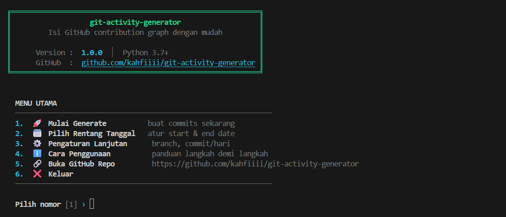
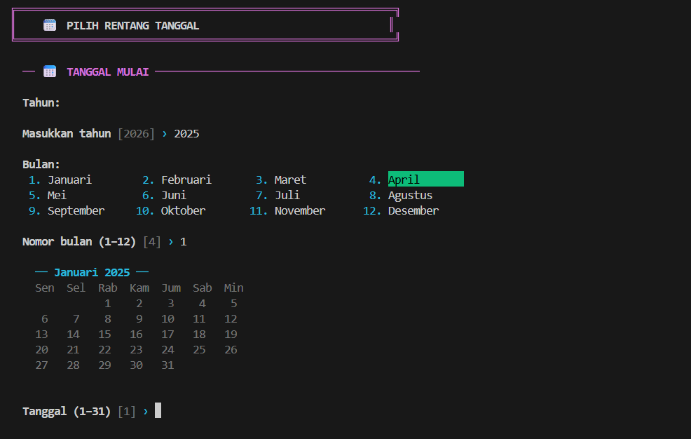
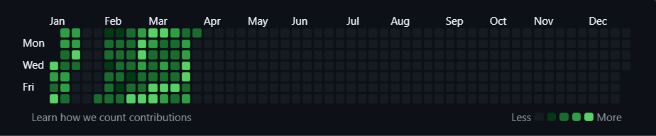

<div align="center">

# 🟢 git-activity-generator

**CLI tool untuk mengisi GitHub contribution graph secara otomatis**  
dengan commit yang terlihat natural — dilengkapi UI interaktif di terminal.

[](https://python.org)
[](LICENSE)
[](https://github.com/kahfiiii/git-activity-generator/stargazers)

</div>

---

## 🖼️ Preview

### Menu Utama



### Pemilihan Tanggal & Kalender



### Hasil di GitHub Contribution Graph



---

## ✨ Fitur

| Fitur | Keterangan |
|---|---|
| 🖥️ UI Interaktif | Menu navigasi lengkap di terminal |
| 🗓️ Date Picker | Pilih tahun, bulan, tanggal + preview kalender berwarna |
| 📊 Preset Commit | Ringan / Normal / Aktif / Gila / Custom |
| 🌿 Multi-branch | Support `main`, `master`, atau nama branch sendiri |
| 📡 Auto Push | Push otomatis ke remote setelah generate |
| 📋 Konfirmasi | Ringkasan lengkap sebelum mulai eksekusi |
| 🔗 Link GitHub | Buka repo langsung dari menu |
| 📦 No Install | Pure Python — tidak butuh library tambahan |

---

## 🚀 Cara Pakai

### 1. Clone repo kosong kamu

```bash
git clone https://github.com/username/nama-repo.git
cd nama-repo
```

### 2. Download script ke dalam folder repo

```bash
# Taruh file git_activity.py di dalam folder repo tersebut
```

### 3. Jalankan

```bash
python git_activity.py
```

Ikuti menu interaktif yang muncul — tidak perlu konfigurasi apapun di awal.

---

## 🗺️ Alur Penggunaan

```
Jalankan script
      │
      ▼
 Menu Utama
 ├── 1. Mulai Generate     ← langsung generate dengan setting saat ini
 ├── 2. Pilih Rentang Tanggal
 │         └── Pilih tahun → bulan → tanggal (dengan preview kalender)
 ├── 3. Pengaturan Lanjutan
 │         ├── Branch (master / main / custom)
 │         ├── Commit/hari (preset atau custom)
 │         └── Opsi push ke remote
 ├── 4. Cara Penggunaan
 ├── 5. Buka GitHub Repo
 └── 6. Keluar
```

---

## ⚙️ Preset Commit per Hari

| Preset | Range | Keterangan |
|---|---|---|
| 🟡 Ringan | 1–2 / hari | Terlihat sesekali aktif |
| 🟢 Normal | 1–4 / hari | **Paling natural** ✓ |
| 🔵 Aktif | 3–7 / hari | Terlihat cukup rajin |
| 🔴 Gila | 5–15 / hari | Super aktif |
| ⚡ Custom | bebas | Atur sendiri min & max |

---

## 📁 Struktur yang Dihasilkan

Script membuat folder `projects/` berisi file-file dummy:

```
projects/
├── todo-cli/main.py
├── expense-tracker/main.py
├── note-manager/main.py
└── ...
```

Setiap commit menambahkan satu baris komentar timestamp ke salah satu file tersebut.

---

## 📋 Requirements

- Python **3.7+**
- Git sudah terinstall dan terkonfigurasi
- Remote repo sudah di-set (`git remote -v` harus ada output)

---

## ⚠️ Tips

- Gunakan preset **Normal** agar contribution graph terlihat natural
- Branch `main` = default GitHub baru, `master` = default lama
- Jika push gagal: cek `git remote -v` dan pastikan sudah login git
- GitHub biasanya update contribution graph dalam beberapa menit setelah push

---

## 📜 License

MIT — bebas digunakan dan dimodifikasi.

---

<div align="center">
  Made with ☕ by <a href="https://github.com/kahfiiii">kahfiiii</a>
</div>
